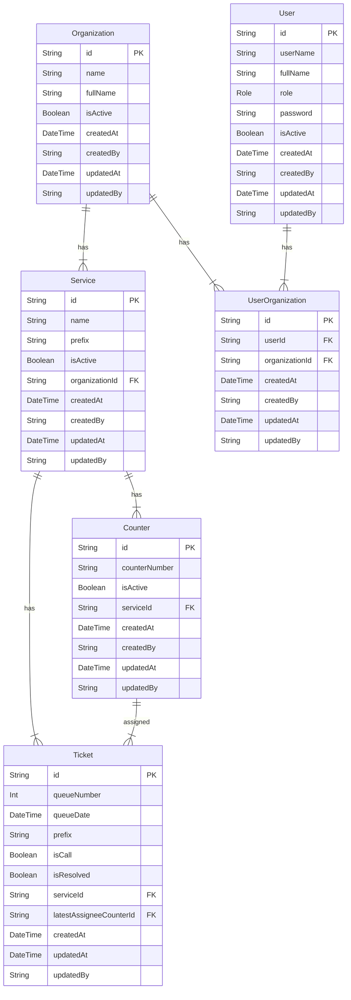

# Entity Relationship Diagram (ERD)

```mermaid
erDiagram
    Organization {
        String id PK
        String name
        String fullName
        Boolean isActive
        DateTime createdAt
        String createdBy
        DateTime updatedAt
        String updatedBy
    }

    Service {
        String id PK
        String name
        String prefix
        Boolean isActive
        String organizationId FK
        DateTime createdAt
        String createdBy
        DateTime updatedAt
        String updatedBy
    }

    Counter {
        String id PK
        String counterNumber
        Boolean isActive
        String serviceId FK
        DateTime createdAt
        String createdBy
        DateTime updatedAt
        String updatedBy
    }

    User {
        String id PK
        String userName
        String fullName
        Role role
        String password
        Boolean isActive
        DateTime createdAt
        String createdBy
        DateTime updatedAt
        String updatedBy
    }

    UserOrganization {
        String id PK
        String userId FK
        String organizationId FK
        DateTime createdAt
        String createdBy
        DateTime updatedAt
        String updatedBy
    }

    Ticket {
        String id PK
        Int queueNumber
        DateTime queueDate
        String prefix
        Boolean isCall
        Boolean isResolved
        String serviceId FK
        String latestAssigneeCounterId FK
        DateTime createdAt
        DateTime updatedAt
        String updatedBy
    }

    Organization ||--|{ Service : "has"
    Organization ||--|{ UserOrganization : "has"
    User ||--|{ UserOrganization : "has"
    Service ||--|{ Counter : "has"
    Service ||--|{ Ticket : "has"
    Counter ||--|{ Ticket : "assigned"
```
